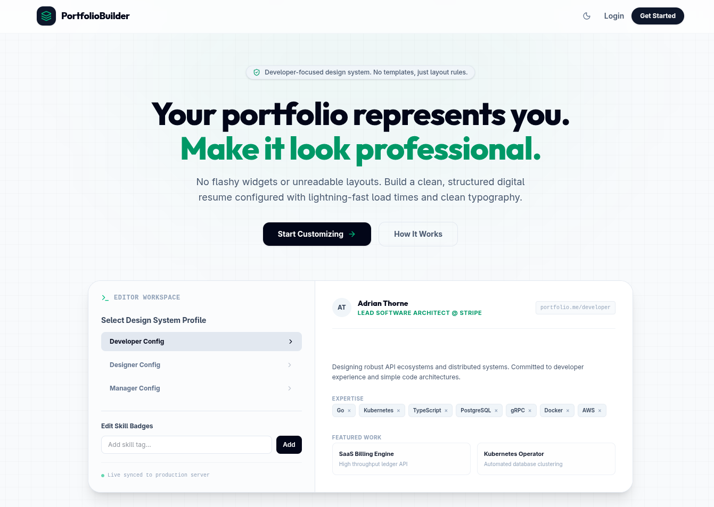
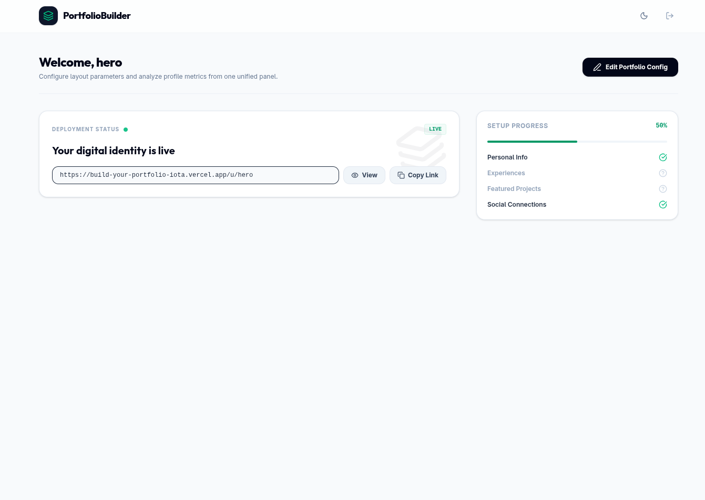
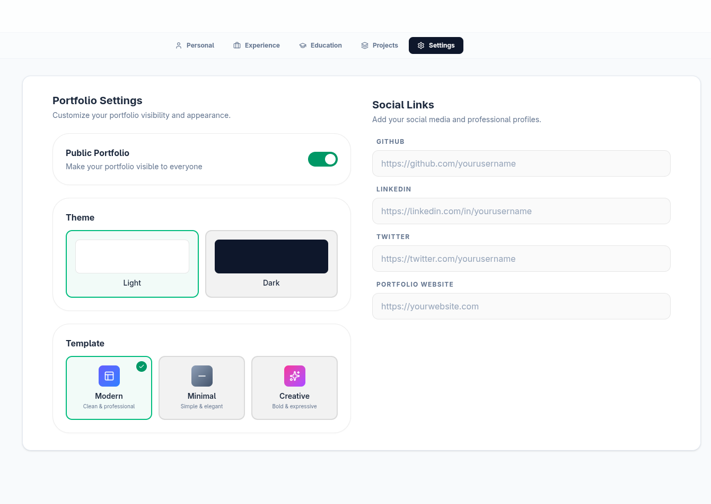
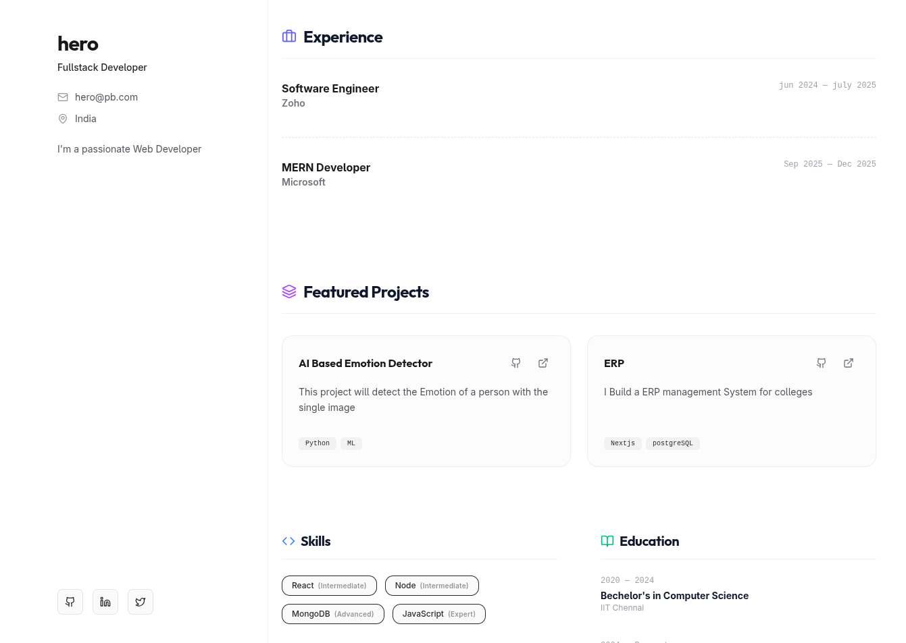
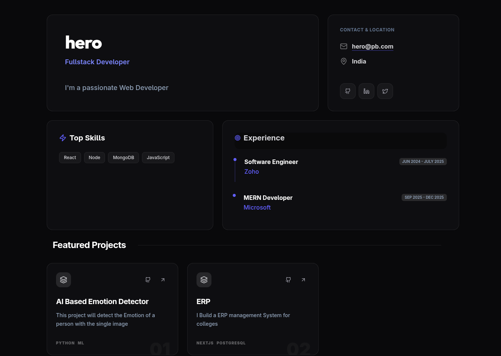
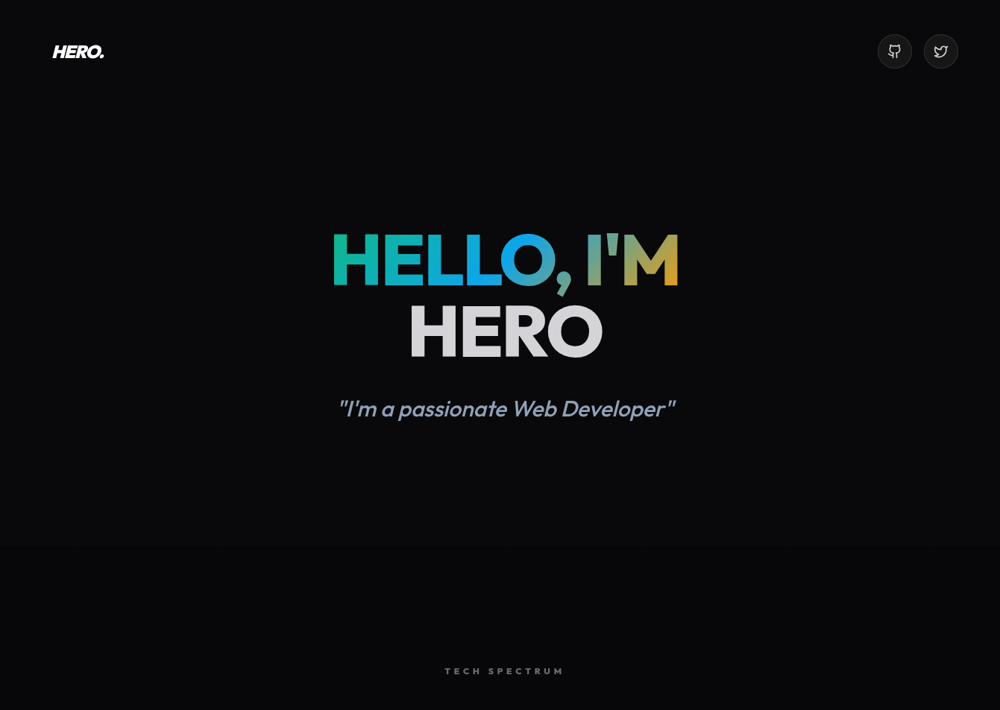

# Build Your Portfolio - No-Code Portfolio Builder for Students

Build Your Portfolio is a modern, full-stack application that enables students to create professional portfolio websites without writing a single line of code. Fill in your details, select a template, and instantly get a shareable public portfolio URL.

Live Demo: https://build-your-portfolio-iota.vercel.app

***

## Screenshots

### Pages

| Landing Page | Dashboard | Editor |
| :---: | :---: | :---: |
|  |  |  |

### Templates

| Modern | Minimal | Creative |
| :---: | :---: | :---: |
|  |  |  |
| Clean and Professional | Simple and Elegant | Bold and Expressive |

***

## Features

### Authentication
- Email and Password registration and login
- JWT-based authentication with 30-day token expiry
- Modal-based authentication interface with backdrop blur and keyboard shortcuts
- Protected routes for Dashboard and Editor
- Persistent sessions via local storage

### Portfolio Builder (Five-Tab Editor)
- **Personal Info**: Name, role, bio, email, location, and skills with proficiency levels
- **Experience**: Work history with company, position, dates, and description
- **Education**: Degrees, institutions, field of study, and year range
- **Projects**: Title, description, tech stack tags, GitHub and live links
- **Settings**: Template selector, theme toggle (light or dark), public or private switch, and social links

### Live Editor
- Real-time tabbed editing with smooth transitions
- Full CRUD (create, read, update, delete) operations for every section
- Save with loading states and success toast notifications
- Instant navigation back to the Dashboard

### Public Portfolio
- Shareable via unique username URL (e.g., /u/username)
- Dynamically renders the chosen template (Modern, Minimal, or Creative)
- Responsive layout across all screen sizes
- Custom 404 state with "Create Yours" call to action

### Dashboard
- Portfolio status overview
- One-click "Copy Link" with clipboard feedback
- Quick access to the Editor
- Loading skeleton with spinner

### Theming
- Global dark and light mode toggle persisted in local storage
- Tailwind CSS dark variant strategy (dark mode by default)
- Per-portfolio theme setting for the public page

***

## User Guide

Follow these steps to build and share your portfolio:

1. **Register**: Click "Get Started" on the landing page to create your account.
2. **Login**: Sign in using your email and password.
3. **Dashboard**: View your portfolio status and your unique shareable link.
4. **Editor**: Click "Edit Portfolio" or "Create Portfolio" to fill out your details:
   - **Personal**: Input your name, role, bio, email, location, and skills.
   - **Experience**: Add details of your work history.
   - **Education**: Add details of your degrees and certifications.
   - **Projects**: Showcase your work with tech stacks and links.
   - **Settings**: Choose a template, set the theme, toggle privacy, and add social links.
5. **Save**: Click the Save button in the top right to persist your changes.
6. **Share**: Copy your public URL from the Dashboard.
7. **View**: Visit /u/username to see your live portfolio.

***

## Development Guide

For developers looking to run the project locally, build, test, or contribute to Build Your Portfolio, please refer to [DOCUMENTATION.md](DOCUMENTATION.md). It contains detailed guides on:
- System Architecture and Data Flow
- Local Development Setup and Installation
- Project Structure and Database Models
- API Reference and Security Settings
- Troubleshooting and Deployment Instructions

***

## Roadmap

Planned features and enhancements:
- Image upload integration with Cloudinary
- QR code generation for portfolio URLs
- PDF resume export functionality
- Analytics dashboard for views, clicks, and visitors
- AI-powered content suggestions
- Custom domain support
- Certifications and achievements sections
- More portfolio templates
- Email verification
- Password reset functionality

***

## License

This project is open source and available for educational purposes.

***

## Contributions

Contributions are welcome. Please fork the repository and submit a pull request with your changes.